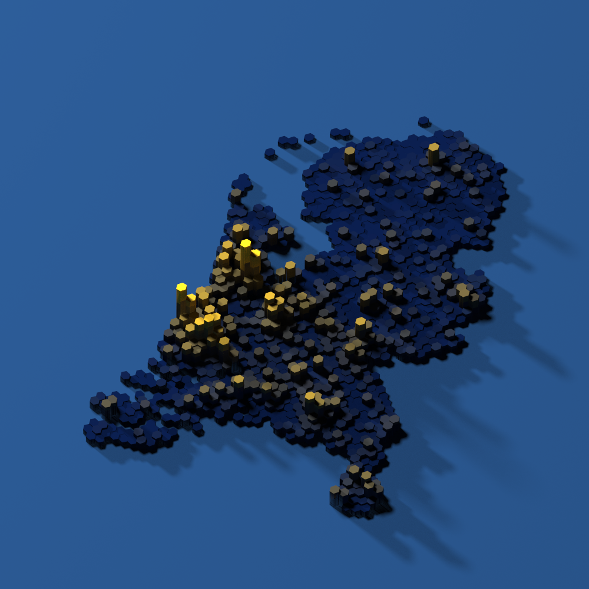

# HexTech Rayshaders

Data is nothing more than zeros and ones without interpretation. To effectively tell the story of data, good and attractive visualizations are important. That's why we want to be able to easily create [this](https://x.com/researchremora/status/1605254154905083905) ourselves!

## Environment Setup

First, install the required package manager:
- [(Mini)Conda](https://docs.conda.io/projects/conda/en/latest/user-guide/install/windows.html) - A powerful package manager that will help set up both Python and R environments

Then follow these steps to create and activate a new environment with R and the necessary Python dependencies:
```
conda create --name rayshaders python=3.13 r-base=4.4 r-essentials
conda activate rayshaders

pip install poetry
poetry install
```

Next, run setup.R to install the R dependencies into the environment:
```
Rscript setup.R
```

Next make sure the .vscode/settings.json paths are set to point VSCode to your R installation:

```
{
    "r.rterm.windows": "C:\\Users\\{USER}\\miniconda3\\envs\\rayshaders\\Scripts\\R.exe",
    "r.rpath.windows": "C:\\Users\\{USER}\\miniconda3\\envs\\rayshaders\\Scripts\\R.exe"
}
```

## Configuration

All parameters for both the Python and R scripts are configured through a `.env` file. 
A sample `.env.example` file is provided with default values. 
Copy the example file to create your own `.env` file:
```
cp .env.example .env
```

Edit the `.env` file to customize the parameters as needed (explaination can be found below).
  

## Usage

First, run the Python script to aggregate the data into hexagons:
```
python src/hexagonize.py
```
This creates:
- `output/hexagons.pkl`: A pickle file containing the hexagonized data
- `output/hexagons.png`: (Optionally) A plot showing the hexagon grid


Next, run the Python script to colorize and export the different channels:
```
python src/colorize.py
```
This creates:
- `output/matrices.h5`: An HDF5 file containing:
  - Height matrix
  - Three color channel matrices (red, green, blue)
- `output/colormap.png`: Gradient distribution of the used color range 
- `output/colorized.png`: (Optionally) A plot showing the colorized visualization


Finally, run the R script to generate the 3D visualization:
```
Rscript src/render.R
```
This creates:
- `output/rendering.png`: The final 3D visualization with lighting and shading effects




The workflow is sequential, with each script building on the output of the previous one. All parameters for these scripts can be configured through the `.env` file.

## Configuration Parameters

The `.env` file contains all parameters for both scripts:

### Input/Output Paths
- `TERRAIN_FILE`: Path to the terrain data file (GeoPackage or shapefile) (default: "input/gemeenten/gemeenten.shp")
- `TERRAIN_LAYER`: Layer name in the terrain GeoPackage (only used for GeoPackage files; default: "provinciegebied")
- `FEATURE_GPKG`: Path to the GeoPackage containing feature data (default: "input/order_data_export_20250413_141033.gpkg")
- `HEXAGONS_PICKLE`: Path to save the hexagonized data (default: "output/hexagons.pkl")
- `HEXAGONS_PLOT`: Path to save the hexagon grid plot (default: "output/hexagons.png")
- `COLORIZED_PLOT`: Path to save the colorized visualization (default: "output/colorized.png")
- `COLORIZED_H5`: Path to save the HDF5 file containing height and color matrices (default: "output/matrices.h5")
- `RENDER_PATH`: Path to save the rendered 3D visualization (default: "output/rendering.png")

### Hexagonization Parameters
- `H3_RESOLUTION`: H3 hexagon grid resolution (4-15, lower = larger hexagons; default: 7)
- `FEATURE_COLUMN`: Column name in the feature GeoPackage to use for height values (default: "order")
- `AGGREGATION_METHOD`: Method to aggregate feature values within hexagons (options: "sum", "avg", "max", "min"; default: "sum")
- `FILTER_COLUMN`: (Optional) Column name to filter features
- `FILTER_CONDITION`: (Optional) Value to filter features by

### Perlin Noise Parameters (Base Terrain)
- `USE_PERLIN`: Toggle between Perlin noise terrain or flat terrain (default: True)
- `NOISE_OCTAVES`: Number of Perlin noise layers (more = more detail/complexity; default: 6)
- `NOISE_VARIATION`: Controls the "zoom" of the Perlin noise pattern (lower = more stretched out pattern, higher = more compressed/detailed pattern; default: 2)
- `NOISE_SCALE`: Maximum scale of Perlin noise relative to feature range (0.0-1.0; default: 0.15)
  - 0.0 = flat terrain
  - 0.5 = terrain can be up to half the feature range
  - 1.0 = terrain can match feature range

### Colorization Parameters
- `COLOR_PALETTE`: Matplotlib colormap used for visualizations (default: "custom")
- `GRADIENT_START`: Start color for the custom gradient in hex format (default: "#05102d")
- `GRADIENT_END`: End color for the custom gradient in hex format (default: "#fec119")
- `BACKGROUND_COLOR`: Background color for areas with no data as comma-separated RGB values in 0-255 range (default: "2,10,30")

### Technical Parameters
- `RASTER_RESOLUTION`: Resolution of the output raster in degrees (lower = higher resolution but larger file size; default: 0.001)
- `HEXAGON_BUFFER`: Buffer size for hexagon generation in degrees (default: 0.001)

### Rendering Parameters
- `HEIGHT_MULTIPLIER`: Multiplier for height values (default: 1500)
- `ZOOM`: Camera zoom level (default: 0.8)
- `THETA`: Horizontal rotation angle in degrees (default: 270)
- `PHI`: Vertical rotation angle in degrees (default: 80)
- `LIGHT_DIRECTION`: Direction of the main light source in degrees (default: 35)
- `LIGHT_ALTITUDE`: Two values controlling light height and secondary light (default: "40,80")
- `LIGHT_COLOR`: Colors of the light sources (default: "white,white")
- `LIGHT_INTENSITY`: Intensity of the light sources (default: "1000,1000")
- `SAMPLES`: Number of samples per pixel for ray tracing (default: 4000)
- `HEIGHT`: Output image height in pixels (default: 1000)
- `WIDTH`: Output image width in pixels (default: 1000)
